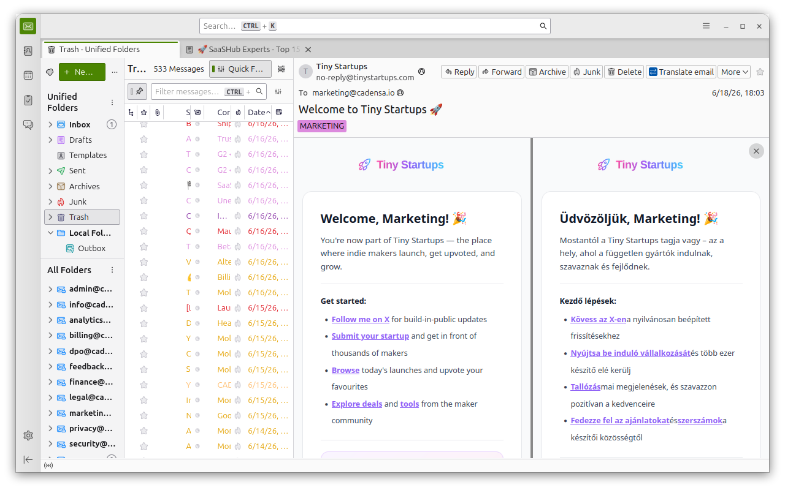
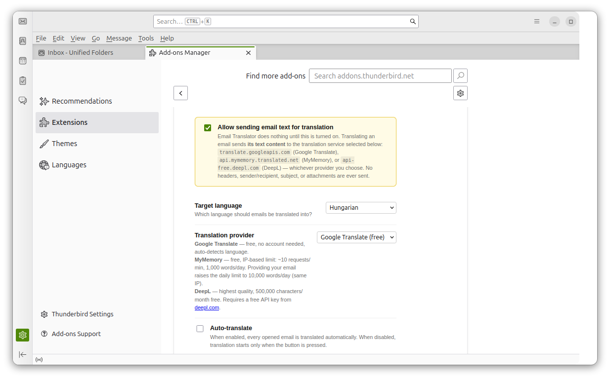

# Email Translator for Thunderbird

Translates the email you are reading into your language and shows it next to the original,
inside Thunderbird. No account, no sign-up: the default engine needs neither a key nor a login.



## What it does

- **Split view** — the original email stays on the left, the translation appears on the right.
  Formatting, links, images and tables are preserved; only the text is replaced.
- **Three engines, your choice** — Google Translate (default), MyMemory or DeepL.
- **Manual or automatic** — translate with the toolbar button, or let every opened email be
  translated automatically.
- **Local cache** — a translated email is stored in your Thunderbird profile and re-opens
  instantly without another request.
- **Nothing leaves your machine until you say so** — translation is disabled until you tick
  *Allow sending email text for translation* in Settings.



## Translation engines

| Engine | Account / key | Limits |
|---|---|---|
| **Google Translate** (default) | none | rate-limited per IP address under heavy use; retried automatically |
| **MyMemory** | none (optional e-mail raises the quota) | ~10 requests/min, 1,000 words/day per IP — 10,000 with an e-mail address |
| **DeepL** | free API key from [deepl.com](https://www.deepl.com/pro-api) | 500,000 characters/month on the free plan |

The engine you pick is the only service contacted. If it fails, the add-on tells you which
engine failed and why — it never falls back to a service you did not choose.

## Privacy

- Nothing is sent anywhere until you explicitly enable translation in Settings.
- What is sent: the **text content** of the email you are reading, to the engine you selected.
  Sender, recipients, subject, headers and attachments are never transmitted.
- A DeepL API key, if you enter one, is stored locally and sent only to DeepL.
- No telemetry, no analytics, no logging. The developer receives nothing.

Full policy: <https://axeri-labs.github.io/thunderbird-email-translator/privacy/>

## Installing

**From addons.thunderbird.net (recommended):** Thunderbird → *Add-ons and Themes* → search for
“Email Translator” → *Add to Thunderbird*.

**From a downloaded file:** Thunderbird → *Add-ons and Themes* → gear icon ⚙ →
*Install Add-on From File…* → pick the `.xpi`.

Requires Thunderbird 102 or later.

## Building from source

There is no build step to speak of — the shipped code is the source, plain JavaScript and HTML.
Packaging is a single `zip` (see [INSTALL.md](INSTALL.md)):

```bash
zip -r email-translator.xpi . \
  --exclude "_work/*" --exclude "_releases/*" --exclude "*.git*" \
  --exclude ".claude/*" --exclude "docs/*" --exclude "*.xpi" --exclude "*.code-workspace"
```

The only third-party library is [DOMPurify](https://github.com/cure53/DOMPurify), vendored
unmodified from its official npm release and used to sanitize translated email HTML before it is
displayed — see [VENDOR.md](VENDOR.md).

To run the add-on from a working copy: `about:debugging` → *This Thunderbird* →
*Load Temporary Add-on…* → pick `manifest.json`.

## License

[MIT](LICENSE) © axeri-labs
